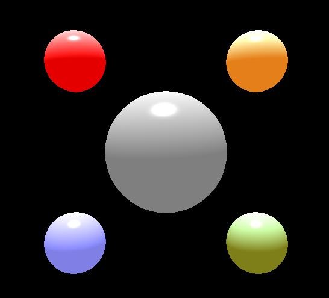
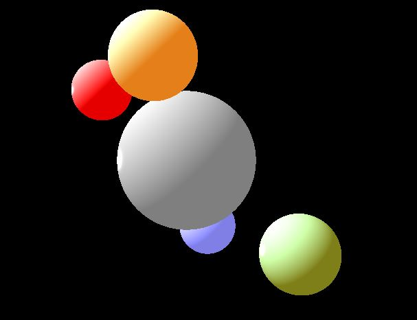

# Sphere Raycasting with Phong Illumination
Winforms application 

Instructons:
Press 'i' to zoom in and 'o' to zoom out.
For rotation use  arrow keys.
To rotate camera up press PgUp and to rotate down use PgDn. 
Analogically for rotation around y axes use left and right key.
(default angle and distance are set up in a way that makes visible the changes easily)

